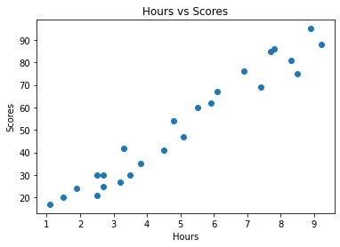
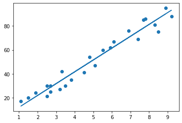

# TSF Task 1 Prediction Using Supervised ML ( Level - Beginner) 

 ### *Kaaviya Modi*

**Importing all libraries required in this notebook**


```python
import pandas as pd
import numpy as np  
import matplotlib.pyplot as plt  
```


```python
data = pd.read_csv("https://raw.githubusercontent.com/AdiPersonalWorks/Random/master/student_scores%20-%20student_scores.csv");
```


```python
data.head()
```


<div>
<style scoped>
    .dataframe tbody tr th:only-of-type {
        vertical-align: middle;
    }

    .dataframe tbody tr th {
        vertical-align: top;
    }

    .dataframe thead th {
        text-align: right;
    }
</style>
<table border="1" class="dataframe">
  <thead>
    <tr style="text-align: right;">
      <th></th>
      <th>Hours</th>
      <th>Scores</th>
    </tr>
  </thead>
  <tbody>
    <tr>
      <th>0</th>
      <td>2.5</td>
      <td>21</td>
    </tr>
    <tr>
      <th>1</th>
      <td>5.1</td>
      <td>47</td>
    </tr>
    <tr>
      <th>2</th>
      <td>3.2</td>
      <td>27</td>
    </tr>
    <tr>
      <th>3</th>
      <td>8.5</td>
      <td>75</td>
    </tr>
    <tr>
      <th>4</th>
      <td>3.5</td>
      <td>30</td>
    </tr>
  </tbody>
</table>
</div>


```python
len (data)
```


    25


**Plotting a 2D graph and finding the relationship between the data manually**


```python
plt.scatter(x = 'Hours', y = 'Scores' , data = data)
plt.title ('Hours vs Scores')
plt.xlabel ('Hours')
plt.ylabel ('Scores')
plt.show()
```


    

    


The data shows linear relation between the number of hours and the scores.

**Adding Features and Targets**


```python
features = data.iloc [: , 0]
target = data.iloc [: , 1]
```

**Train Test Split**


```python
from sklearn.model_selection import train_test_split
```


```python
X_train, X_test , y_train , y_test = train_test_split(features , target , test_size = 0.2 , random_state=0)
```


```python
from sklearn.linear_model import LinearRegression
```

**Training the Algorithm and using LINEAR REGRESSION**


```python
lr = LinearRegression()
```


```python
X_train = X_train.values.reshape((-1,1))
```


```python
X_test = X_test.values.reshape((-1,1))
```


```python
lr.fit(X_train , y_train )
```


    LinearRegression()


```python
y = lr.coef_*features + lr.intercept_
plt.scatter(x = 'Hours' ,y = 'Scores' , data = data)
plt.plot(features , y )
plt.show()
```


    

    


**Making Predictions**


```python
predictions = lr.predict(X_test)
```


```python
pd.DataFrame({'Original': y_test ,'Predicted':predictions })
```


<div>
<style scoped>
    .dataframe tbody tr th:only-of-type {
        vertical-align: middle;
    }

    .dataframe tbody tr th {
        vertical-align: top;
    }

    .dataframe thead th {
        text-align: right;
    }
</style>
<table border="1" class="dataframe">
  <thead>
    <tr style="text-align: right;">
      <th></th>
      <th>Original</th>
      <th>Predicted</th>
    </tr>
  </thead>
  <tbody>
    <tr>
      <th>5</th>
      <td>20</td>
      <td>16.884145</td>
    </tr>
    <tr>
      <th>2</th>
      <td>27</td>
      <td>33.732261</td>
    </tr>
    <tr>
      <th>19</th>
      <td>69</td>
      <td>75.357018</td>
    </tr>
    <tr>
      <th>16</th>
      <td>30</td>
      <td>26.794801</td>
    </tr>
    <tr>
      <th>11</th>
      <td>62</td>
      <td>60.491033</td>
    </tr>
  </tbody>
</table>
</div>


```python
hours = 9.25
answer = lr.predict([[hours]])
print(f"The Predicted score is: {answer[0]:.3f} if a student studies for 9.25 hrs/ day")
```

    The Predicted score is: 93.692 if a student studies for 9.25 hrs/ day
    

**Evaluating the model**


```python
from sklearn.metrics import mean_squared_error, r2_score
```


```python
print(f"Mean Squared Error : {mean_squared_error(y_test , predictions)}")
print(f"Root Mean Squared Error : {mean_squared_error(y_test , predictions , squared = False)}")
print(f"R2-Score : {r2_score(y_test , predictions)}")
```

    Mean Squared Error : 21.5987693072174
    Root Mean Squared Error : 4.6474476121003665
    R2-Score : 0.9454906892105356
    
