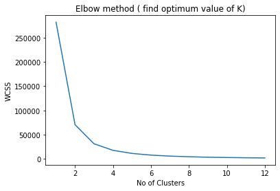
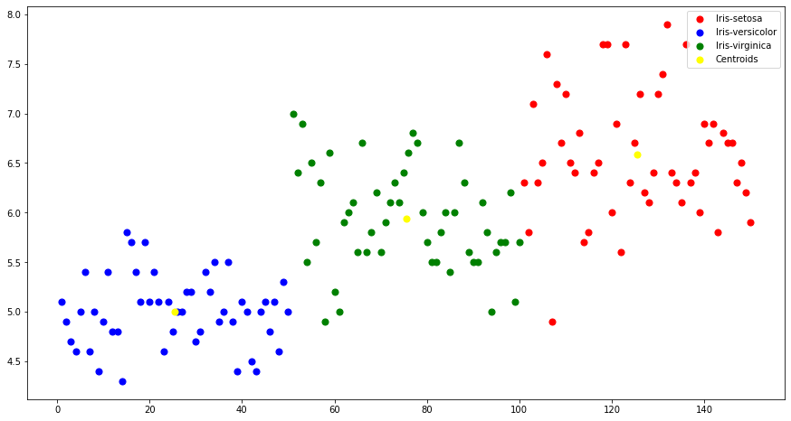

# TSF Task 2 Prediction Using Unsupervised ML ( Level - Beginner) 

### *Kaaviya Modi*

**Importing all libraries required in this notebook**


```python
import numpy as np
import pandas as pd
import matplotlib.pyplot as plt
```


```python
data = pd.read_csv('iris.csv')
```


```python
data.head()
```


<div>
<style scoped>
    .dataframe tbody tr th:only-of-type {
        vertical-align: middle;
    }

    .dataframe tbody tr th {
        vertical-align: top;
    }

    .dataframe thead th {
        text-align: right;
    }
</style>
<table border="1" class="dataframe">
  <thead>
    <tr style="text-align: right;">
      <th></th>
      <th>Id</th>
      <th>SepalLengthCm</th>
      <th>SepalWidthCm</th>
      <th>PetalLengthCm</th>
      <th>PetalWidthCm</th>
      <th>Species</th>
    </tr>
  </thead>
  <tbody>
    <tr>
      <th>0</th>
      <td>1</td>
      <td>5.1</td>
      <td>3.5</td>
      <td>1.4</td>
      <td>0.2</td>
      <td>Iris-setosa</td>
    </tr>
    <tr>
      <th>1</th>
      <td>2</td>
      <td>4.9</td>
      <td>3.0</td>
      <td>1.4</td>
      <td>0.2</td>
      <td>Iris-setosa</td>
    </tr>
    <tr>
      <th>2</th>
      <td>3</td>
      <td>4.7</td>
      <td>3.2</td>
      <td>1.3</td>
      <td>0.2</td>
      <td>Iris-setosa</td>
    </tr>
    <tr>
      <th>3</th>
      <td>4</td>
      <td>4.6</td>
      <td>3.1</td>
      <td>1.5</td>
      <td>0.2</td>
      <td>Iris-setosa</td>
    </tr>
    <tr>
      <th>4</th>
      <td>5</td>
      <td>5.0</td>
      <td>3.6</td>
      <td>1.4</td>
      <td>0.2</td>
      <td>Iris-setosa</td>
    </tr>
  </tbody>
</table>
</div>


```python
data['Species'].value_counts()
```


    Iris-setosa        50
    Iris-versicolor    50
    Iris-virginica     50
    Name: Species, dtype: int64


```python
features = data.iloc[: , :-1].values
```

**K-Means**


```python
from sklearn.cluster import KMeans
```


```python
wcss = [] ## Within-Cluster Sum of Square
for i in range(1,13):
    kmeans = KMeans(init='k-means++' , n_clusters = i , random_state = 0)
    kmeans.fit(features)
    wcss.append(kmeans.inertia_)
```


```python
plt.plot(range(1,13) , wcss)
plt.title('Elbow method ( find optimum value of K)')
plt.xlabel('No of Clusters')
plt.ylabel('WCSS')
plt.show()
```


    

    


```python
## Optimum Wcss point where cluster == 3.
## so we take n_clusters = 3 and make the model
```


```python
kmeans = KMeans(init='k-means++' , n_clusters = 3 ,random_state = 0)
kmeans.fit(features)
prediction = kmeans.predict(features)
```

**Final Clusters**


```python
plt.figure(figsize=(15,8))

plt.scatter(features[prediction==0,0], features[prediction==0,1], c="red", s=50, label="Iris-setosa")
plt.scatter(features[prediction==1,0], features[prediction==1,1], c="blue", s=50, label="Iris-versicolor")
plt.scatter(features[prediction==2,0], features[prediction==2,1], c="green", s=50, label="Iris-virginica")

#Plotting the centroids of the clusters
plt.scatter(kmeans.cluster_centers_[:,0], kmeans.cluster_centers_[:,1], c="yellow", 
            s=50, label="Centroids")

#descibing the elements of the graph
plt.legend()
```


    <matplotlib.legend.Legend at 0x247c9bdd2e0>


    

    


```python

```
